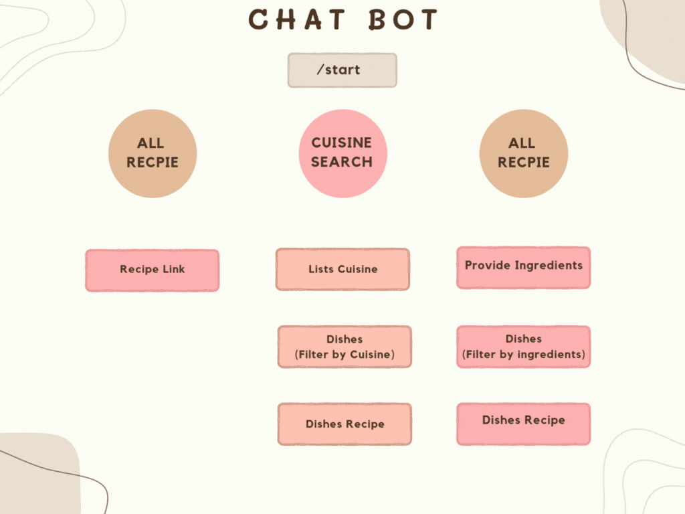

# Enhanced Recipe Recommender: Introducing additional features and addressing issues for an improved user experience.


<br><br>
## Watch how our application works: 
### Click here to watch - [Drive](https://drive.google.com/file/d/1jFzHKE4TvadCJSLQ7Z1XGD1AoiM-CxZO/view?usp=sharing) <br>
<br><br>

[](https://www.javascript.com/)
[](https://doi.org/10.5281/zenodo.14226806)
[](https://github.com/pnprathima/Recipe_Recommender/issues)
[](https://badgen.net/github/stars/pnprathima/Recipe_Recommender)

[](https://app.travis-ci.com/pnprathima/Recipe_Recommender)
[](https://codecov.io/gh/usmanwardag/dollar_bot)
[](https://github.com/prettier/prettier)
[](https://github.com/pnprathima/Recipe_Recommender/actions/workflows/Respost.yml)

[](https://github.com/pnprathima/Recipe_Recommender/actions/workflows/Code_Formatter_and_Syntax_Check.yml)
[](https://github.com/pnprathima/Recipe_Recommender/actions/workflows/coverage.yml)


[](https://opensource.org/licenses/MIT)

   
   
<h2> What is Recipe Recommender? </h2>

Introducing Recipe Recommender—the smart solution to your cooking dilemmas! Our latest version is packed with new features designed to make your kitchen experience smoother, more interactive, and more personalized than ever.

With SSO Sign-In, logging in has never been easier or more secure—now you can access your account via social media or email with just a click. Our AI-Powered Recipe Suggestions take personalization to a new level, recommending dishes that fit your tastes and ingredients seamlessly. To make exploring recipes even more intuitive, we’ve introduced an Interactive Chatbot that offers three tailored options to help you find exactly what you’re craving. And, with an Enhanced UI and Bug Fixes, browsing and saving recipes is smoother than ever.

From personalized recommendations to a sleek, user-friendly design, Recipe Recommender is here to inspire your next delicious creation!


<br> <b> More about our new additions in our next section!</b>

## Feature additions: Enhancements, Upgrades and BugFixes:
Presenting our latest additions: Here's a comprehensive list of all our new features, enhancements, and upgrades! <br>
1. Advanced Filter: Our application now features advanced filter feature for the recipes, allowing you to filter the recipes based on the time you have to prepare the meal and the dietary choices you have (vegetarian, non-vegetarian, vegan) allowing you to fit you schedule and dietary needs, while saving you time and effort.

2. Calorie Count: This feature gives you a quick idea of the nutritional value of your meal, making it easier to plan meals that align with your health goals. Whether you’re tracking calories or just curious about the nutritional content of a dish, this feature has you covered.

3. Enhanced BookMark Management: You can now delete bookmarks directly from the bookmarks page. Just navigate to your bookmarked recipes and remove any recipe with a single click. This improvement is all about convenience, helping you manage your saved recipes without unnecessary back-and-forth navigation.

### Interaction Flows for Chatbot

1. **Search Recipe by Name**

   - **Prompt**: After `/start`, select the option to name a recipe.
   - **Outcome**: Receive step-by-step instructions if the recipe is available.

2. **Find Recipes by Ingredients**

   - **Prompt**: Provide the ingredients you have.
   - **Outcome**: Get suggestions for recipes you can make.

3. **Access the Website**

   - **Prompt**: Choose to open the website.
   - **Outcome**: Receive a link to our website.


## Documentation and Project Flow:
 <br><br>
 <br><br>
1. User Registration and Authentication: A Universal sign in page, where you can create an account or sign up through any of you social media accounts
3. Search Recipes by Ingredients: Input your available ingredients to discover relevant recipes based on ingredient names.
4. Search Recipes by Dish Name: Locate recipes by specifying the dish name in the search.
5. Add a Recipe: Share details such as ingredients, dish name, time, cuisine, instructions, and optional images to contribute your recipe.
6. Bookmark Favorite Recipes: Save preferred recipes for easy access.
7. View Bookmarked Recipes in User Profile: Access and review all saved recipes conveniently stored under your user profile.
8. Logout: Securely Logout will again take you to our landing page, where you will be required to log in <br><br>


Source documentation can be found at: [Recipe Recommender Docs](https://github.com/pnprathima/Recipe_Recommender/blob/master/Recipe%20Recommender%20Source%20Documentation.pdf)


## API Documentation
**Get Recipes:**
Retrieve a list of recipes based on specified filters like ingredients, cuisine, and page parameters. Success returns a code of 200 with the recipe list; error returns code 500 with an error message.

**Get Recipe Cuisines:**
Fetches available cuisines, responding with a code of 200 and an array of cuisine strings on success. In case of an error, it returns a code of 500 with an error message.

**Add Recipe:**
Allows users to add a new recipe via the /addRecipe endpoint, responding with a code of 200 and the inserted recipe's ID on success. In case of an error, it returns a code of 500 with an error message.

**Get Ingredients:**
Retrieves a list of distinct ingredients through the /callIngredients endpoint. Success returns a code of 200 with an array of ingredient strings; error returns code 500 with an error message.

**User Signup:**
Our application utilizes Auth0's APIs to provide Single Sign-On (SSO) authentication, allowing users to sign in through social media accounts or create a new account within our system. This integration supports various identity protocols, including OpenID Connect, OAuth, and SAML.

**Get Bookmarks:**
Retrieves bookmarked recipes for a user through the /getBookmarks endpoint. Success returns a code of 200 with an array of bookmarked recipes; error returns code 500 with an error message.

**Add Recipe to User Profile:**
Adds a recipe to a user's profile bookmarks via the /addRecipeToProfile endpoint. Success returns a code of 200 with the count of modified items; error returns code 500 with an error message.

**OPEN AI API**
Suggests you recipe, powered by artifical intelligence.


<br>Detailed documentation can be found at: [API Docs](https://github.com/pnprathima/Recipe_Recommender/blob/master/API_Documentation.pdf)

## Technology Stack


<br>Detailed documentation can be found at: [TechStack Docs](https://github.com/pnprathima/Recipe_Recommender/blob/master/TechStack-Docs)

## Key Software Requirements

- [Node.js v20.17.0](https://nodejs.org/en/download/)
- [NPM v10.8.2](https://nodejs.org/en/download/)

## Project Setup Steps:

### Installation:
Check out our comprehensive YouTube video demonstrating each step for easy guidance. [Project Setup](https://youtu.be/uKh-afpUdh0)
- clone repository using `https://github.com/Software-Engineering-Folks/RecipeRecommender.git`
- setup for frontend
  open terminal and navigate to the **frontend** folder and execute the following:
  ```
  npm install
  ```
- setup for backend
  open terminal and navigate to the **backend** folder and execute the following:

  ```
  npm install
  ```

  ## Execution Steps

1.  start backend server using:
    ```
    npx nodemon
    ```
2.  start frontend server using:
    ```
    npm start
    ```
3.  Automatically a browser window is opened which shows frontend.
4.  run `npm test` for running the tests [Dependencies: Jest, Chai, Supertest]


## Release Made in this cycle <br>
1. Major release 5.1 - Added new Advanced Filter Search
2. Major Release 5.2 - Included calorie count for each individual serving
3. Major Release 5.3 - Created a delete bookmark option directly in the book mark window<br>
<br>


### IDE and Code Formatter

- [Visual Studio Code](https://code.visualstudio.com/) IDE
- [Prettier Formatter for Visual Studio Code](https://github.com/prettier/prettier-vscode/blob/main/README.md)


## :page_facing_up: License <a name="License"></a>

This project is licensed under the terms of the MIT license. Please check [License](https://github.com/SE-Fall-2024-Team-69/RecipeRecommender/blob/master/LICENSE) for more details.

## :pencil2: Contributions <a name="Contributions"></a>

Please see our [CONTRIBUTING.md](https://github.com/SE-Fall-2024-Team-69/RecipeRecommender/blob/master/CONTRIBUTING.md) for instructions on how to contribute to the project by completing some of the issues.

## FUTURE SCOPE

1. Add scrapers: Retrieve recipes from already existing websites.
2. Recipe Recommendations: Suggest similar recipes with a smart recommendation model.
3. Ingredient Price Comparison: Link ingredients to compare prices across multiple websites.
4. Smart Meal Planner: Automatically generate weekly meal plans and grocery lists based on user preferences and available ingredients.

## Team Members

Mullamuri, Venkata Yaswanth <br>
Gupta, Ayush <br>
Baddi, Yaswanth <br>

## Troubleshooting and Support
Common issues observed and solutions:<br>
1. Sometimes there would be vulnerabilities found in the backend, so fix it by running 'npm install nodemon --save-dev', because npm audit fix --force won't fix it.
2. The Auth0 login may occasionally experience callback errors if specific URLs aren’t specified on the application page. If you encounter this issue, ensure you add the hosting address to the allowed callback URLs </br>
Facing other issues with the application? Mail us - [software.72.engineering@gmail.com](software.72.engineering@gmail.com)


<p align="center">Made with ❤️ on GitHub.</p>
