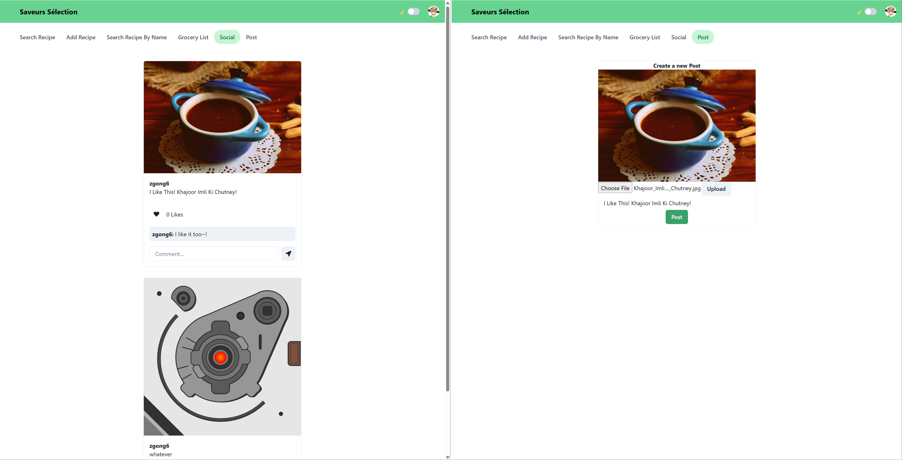
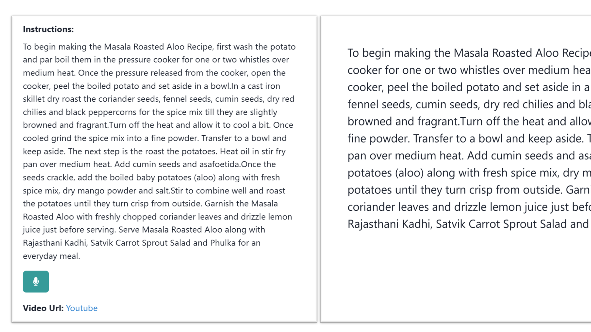
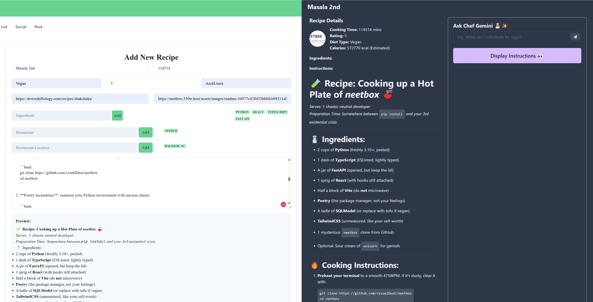
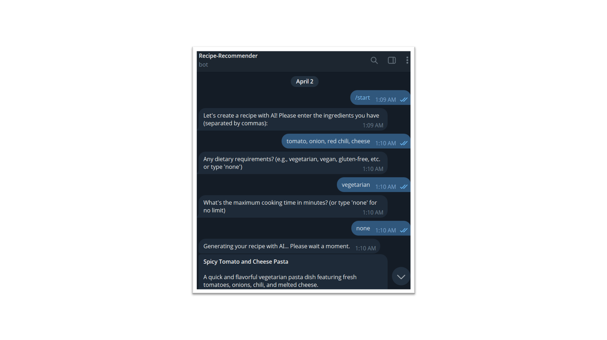

# Saveur Sélection: Your AI-powered Recipe Recommender!

[](https://www.javascript.com/) [](https://doi.org/10.5281/zenodo.14226806) [](https://github.com/csc510g12/Recipe-Recommender-V2/issues) [](https://github.com/csc510g12/Recipe-Recommender-V2/issues?q=is%3Aissue%20state%3Aclosed) [](https://github.com/csc510g12/Recipe-Recommender-V2) [](https://codecov.io/gh/usmanwardag/dollar_bot) [](https://github.com/prettier/prettier) [](https://github.com/csc510g12/Recipe-Recommender-V2/actions/workflows/Respost.yml)  [](https://github.com/csc510g12/Recipe-Recommender-V2/actions/workflows/Code_Formatter_and_Syntax_Check.yml) [](https://github.com/csc510g12/Recipe-Recommender-V2/actions/workflows/coverage.yml)  [](https://github.com/csc510g12/Recipe-Recommender-V2/blob/main/LICENSE)


## SE25/G12 new version is out!

### Short Videos for newly added features:

- [Social Media Posts, Voice Cooking Instructions](https://drive.google.com/file/d/1gX8Qp8OZW3hiSyWRSCC0TALqqZmDYGxr/view?usp=sharing) by [Alex Kuang](https://github.com/azkuang)
- [Dark Theme, Big Screen Mode, Markdown Supported Cooking Instructions](https://drive.google.com/file/d/1gX8Qp8OZW3hiSyWRSCC0TALqqZmDYGxr/view?usp=sharing) by [Gavin Gong](https://github.com/VisualDust)
- [AI-Powered Recipe Generation Accessable from Telegram](todo) by [Ohm Desai](https://github.com/odesai840)

### What's new?

**📍Social Media Posts:** Share your ideas and cooking experiences with community.



**🎨 Dark Theme:** Reading at night, without hurting eyes.


**🎙️ Voice Instruction and Big Screen Mode:** Cooking made easy with voice instructions and big screen mode.



**📜 Markdown Support for Cooking Instruction:** Format rich format for cooking instruction.



**👩‍🍳 AI-Powered Recipe Generation Accessable from Telegram:** Generate recipes based on your available ingredients, dietary preferences, and cooking style.



## So what are you waiting for? Go checkout Saveurs Sélection now!

## Table of Contents

- [Saveur Sélection: Your AI-powered Recipe Recommender!](#saveur-sélection-your-ai-powered-recipe-recommender)
  - [SE25/G12 new version is out!](#se25g12-new-version-is-out)
    - [Short Videos for newly added features:](#short-videos-for-newly-added-features)
    - [What's new?](#whats-new)
  - [So what are you waiting for? Go checkout Saveurs Sélection now!](#so-what-are-you-waiting-for-go-checkout-saveurs-sélection-now)
  - [Table of Contents](#table-of-contents)
  - [What is Recipe Recommender?](#what-is-recipe-recommender)
    - [Cook smarter, save time, and enjoy stress-free meal planning.](#cook-smarter-save-time-and-enjoy-stress-free-meal-planning)
  - [Basic project Flow:](#basic-project-flow)
    - [Here are a few user interactions / case-studies to demonstrate how our system works:](#here-are-a-few-user-interactions--case-studies-to-demonstrate-how-our-system-works)
    - [More source documentation can be found at: Recipe Recommender Docs](#more-source-documentation-can-be-found-at-recipe-recommender-docs)
  - [API Documentation](#api-documentation)
      - [All APIs are present in the folder `Code/backend/api`. These APIs handle user authentication, recipe management, bookmarking, and AI-powered recipe generation and recommendations.](#all-apis-are-present-in-the-folder-codebackendapi-these-apis-handle-user-authentication-recipe-management-bookmarking-and-ai-powered-recipe-generation-and-recommendations)
  - [Technology Stack](#technology-stack)
  - [Key Software Requirements](#key-software-requirements)
  - [Project Setup Steps:](#project-setup-steps)
    - [Check out INSTALL.md for detailed instruction on how to setup the entire project with MongoDB atlas and AWS EC2.](#check-out-installmd-for-detailed-instruction-on-how-to-setup-the-entire-project-with-mongodb-atlas-and-aws-ec2)
    - [Quick Start Guide](#quick-start-guide)
  - [Execution Steps](#execution-steps)
    - [IDE and Code Formatter](#ide-and-code-formatter)
  - [License](#license)
  - [How to Contribute](#how-to-contribute)
  - [Team Members](#team-members)
    - [Contributors for version 2.0](#contributors-for-version-20)
    - [Past Contributors:](#past-contributors)
    - [Project Mentors](#project-mentors)
  - [Cite this project](#cite-this-project)
  - [Support - How to contact us when you hit rock-bottom?](#support---how-to-contact-us-when-you-hit-rock-bottom)
    - [Facing other issues with the application?](#facing-other-issues-with-the-application)

   
## What is Recipe Recommender?

Introducing Saveurs Sélection—the smart solution to your cooking dilemmas! If you have ever struggled to decide what to cook then this application is just for you! Saveurs Sélection suggests recipes based on the ingredients you already have. Our AI Chef Gemini provides smart substitutions, so you're never out of options. Need a fully customized dish? Generate complete recipes just for you.
Plus, our auto-generated grocery list simplifies shopping for any recipe you wish to cook. It is our mission to enable our users to -

### Cook smarter, save time, and enjoy stress-free meal planning.

With SSO Sign-In, logging in has never been easier or more secure—now you can access your account via social media or email with just a click. Our AI-Powered Recipe Suggestions take personalization to a new level, recommending dishes that fit your tastes and ingredients seamlessly. To make exploring recipes even more intuitive, we’ve introduced Chef Gemini! - an AI Chef that offers tailored options to help you find exactly what you’re craving. And, with an Enhanced UI and Bug Fixes, browsing and saving recipes is smoother than ever.


## Basic project Flow:
 <br>

### Here are a few user interactions / case-studies to demonstrate how our system works:

1. User Registration and Authentication:
Users can create an account using an email and password combination or sign in through supported social media platforms such as Google or Facebook. The authentication process ensures secure access to user data while managing sessions effectively. Upon successful login, users gain access to personalized features, including bookmarked recipes, AI-powered recommendations, and profile-based preferences.

   [](/images/login_rr.png) <br>

2. Smart Recipe Search:
Users can search for recipes in multiple ways. By entering a list of available ingredients, the system filters and returns relevant recipes that match the provided inputs. Alternatively, users can locate specific recipes by searching with a dish name. If no exact matches are found, Chef Gemini, the AI-powered assistant, can generate a new recipe based on the user's ingredients, dietary preferences, and cooking style, ensuring that users always have an option to cook with what they have on hand.

   [](/images/home_screen_rr.png) <br>
   [](/images/ai_recipe_rr.png) <br>


3. Add a Recipe:
Users can contribute new recipes to the system by providing details such as the dish name, a list of ingredients, preparation time, cuisine type, and step-by-step instructions. Additionally, they have the option to upload an image to accompany the recipe. Once submitted, the recipe is stored in the database, making it available for search and discovery within the system.

   [](/images/add_recipe_rr.png) <br>

4. AI-Powered Recipe Customization:
For existing recipes, users have the ability to request ingredient substitutions tailored to specific needs. Chef Gemini can modify recipes based on dietary restrictions such as gluten-free, vegan, or lactose-intolerant options. Additionally, users focused on health and fitness can request modifications to align with specific goals such as high-protein, low-carb, or keto-friendly diets. If certain ingredients are unavailable, the system provides suitable alternatives, ensuring that users can still prepare the dish with accessible substitutions.

   [](/images/AI_subs_rr.png) <br>
   [](/images/chef_gemini_rr.png) <br>

5. Bookmark Recipes:
Users can save recipes for future reference by bookmarking them. All bookmarked recipes are stored within the user’s profile, allowing for quick and easy access without requiring repeated searches.

   [](/images/bookmarks_rr.png) <br>

6. User Profile & Grocery List Generation:
The user profile serves as a central hub for managing all bookmarked recipes, enabling users to review and access saved content at any time. Additionally, users can generate a grocery list based on any bookmarked recipe. The system compiles a structured shopping list by extracting the required ingredients, ensuring a seamless transition from meal planning to grocery shopping.

   [](/images/grocery_rr.png) <br>

7. Secure Logout:
Users can securely log out of their accounts, terminating the active session and redirecting them to the landing page. Future access will require re-authentication, maintaining security and ensuring that user data remains protected.

### More source documentation can be found at: [Recipe Recommender Docs](https://github.com/csc510g12/Recipe-Recommender-V2/tree/main/docs)


## API Documentation

#### All APIs are present in the folder `Code/backend/api`. These APIs handle user authentication, recipe management, bookmarking, and AI-powered recipe generation and recommendations.

`apiOAuthLogin`
This endpoint processes OAuth-based login requests. It checks if the provided email already exists in the database and, if not, creates a new user with a default password. The response indicates whether the user was successfully created or if the email is already registered.

`apiAuthLogin`
This endpoint handles authentication using a username and password provided as query parameters. It searches the database for a matching user and returns a success status along with user details if authentication is successful.

`apiAuthSignup`
This endpoint allows new users to sign up by providing a username and password in the request body. It creates a new user in the database and returns a success flag along with user details upon completion.

`apiGetBookmarks`
This endpoint retrieves the list of bookmarked recipe IDs for a given username provided as a query parameter. If the username is missing, an error message is returned. The response contains an array of bookmarked recipes.

`apiGetBookmarkedRecipes`
This endpoint returns detailed information about all recipes a user has bookmarked. The username must be provided as a query parameter. The response contains a list of complete recipe details, including ingredients and instructions.

`apiPostRecipeToProfile`
This endpoint allows users to add a specific recipe to their profile. The request body must include the username and the recipe object. The response confirms whether the recipe was successfully added to the user’s profile.

`apiRemoveRecipeFromProfile`
This endpoint removes a specified recipe from a user’s profile. The request body must include the username and the recipe object. The response confirms whether the removal was successful.

`apiGetRecipeByName`
This endpoint allows users to search for recipes by name using a query parameter. The response includes a list of recipes matching the search criteria, along with their details.

`apiGetRecipes`
This endpoint retrieves recipes based on filters such as ingredients, cuisine type, cooking time, dietary restrictions, and user preferences. The response contains a paginated list of recipes that match the filters along with metadata about the number of results.

`apiGetRecipeCuisines`
This endpoint returns a list of all available cuisines stored in the database. The response is an array of cuisine names that can be used for filtering recipes.

`apiPostRecipe`
This endpoint allows users to submit a new recipe to the system. The request body must contain structured recipe details such as name, ingredients, and instructions. The response confirms whether the recipe was successfully added.

`apiGetIngredients`
This endpoint retrieves a list of all ingredients available in the system. It responds with an array of ingredient names that users can use when searching for recipes.

`apiGenerateRecipe`
This endpoint generates a complete recipe using AI based on user-provided ingredients, cuisine preferences, maximum cooking time, and dietary restrictions. The AI model returns a structured JSON response containing the recipe name, description, ingredients, and step-by-step instructions.

`apiAiChef`
This endpoint provides AI-powered recipe recommendations and ingredient substitution suggestions. The request body must include recipe details and a user query. The AI model processes the information and returns personalized cooking recommendations or ingredient substitutions based on the given constraints.

`apiGetGroceryList`
This endpoint retrieves a structured grocery list based on the recipes a user has bookmarked. The request requires a username as a query parameter, and the response includes a categorized list of ingredients needed to prepare the selected recipes.

A more comprehensive API documentation can be found at: [Recipe Recommender Docs](https://github.com/csc510g12/Recipe-Recommender-V2/tree/main/docs)

## Technology Stack

       

<br>Detailed documentation can be found at: [TechStack Docs](/TechStack-Docs)

## Key Software Requirements

- [Node.js v20.17.0](https://nodejs.org/en/download/)
- [NPM v10.8.2](https://nodejs.org/en/download/)
- [Git]()

## Project Setup Steps:

### Check out [INSTALL.md](/INSTALL.md) for detailed instruction on how to setup the entire project with MongoDB atlas and AWS EC2.

### Quick Start Guide

- clone repository using 
   ```sh
   git clone <repo_name>
   ```

- setup for frontend
  open terminal and navigate to the **frontend** folder and execute the following:
  ```
  npm install
  ```
- setup for backend
  open terminal and navigate to the **backend** folder and execute the following:

  ```
  npm install
  ```

  ## Execution Steps

1.  start backend server using:
    ```
    npx nodemon
    ```
2.  start frontend server using:
    ```
    npm start
    ```
3.  Automatically a browser window opens `locahost:3000/`.

4.  run `npm test` for running the tests [Dependencies: Jest, Chai, Supertest]


### IDE and Code Formatter

- [Visual Studio Code](https://code.visualstudio.com/) IDE
- [Prettier Formatter for Visual Studio Code](https://github.com/prettier/prettier-vscode/blob/main/README.md)


## License

This project is licensed under the terms of the MIT license. Please check [License](/LICENSE) for more details.

## How to Contribute

Please see our [CONTRIBUTING.md](/CONTRIBUTING.md) for instructions on how to contribute to the project by completing some of the [issues](https://github.com/csc510g12/Recipe-Recommender-V2/issues).

## Team Members

This project is a collaborative effort by a dedicated team of developers and mentors, working together to enhance and refine its features over multiple iterations. We appreciate the contributions of both current and past members who have played a vital role in shaping this project.  


### Contributors for version 2.0

- [Alex Kuang](https://github.com/azkuang)
- [Gavin Gong](https://github.com/VisualDust)
- [Ohm Desai](https://github.com/odesai840)

### Past Contributors:

- Ayush Gala
- Keyur Gondhalekar
- Ayush Pathak
- Mullamuri, Venkata Yaswanth
- Gupta, Ayush
- Baddi, Yaswanth
- [etc.](https://github.com/csc510g12/Recipe-Recommender-V2/graphs/contributors)

### Project Mentors

Dr. Timothy Menzies <br>
Mrs. Katerina Vilkomir

## Cite this project  

If you use this project in your research or applications, please cite it as follows:  

```yaml
cff-version: 1.2.0
message: "If you use this software, please cite it as below."
authors:
  - family-names: "Gala"
    given-names: "Ayush"
  - family-names: "Pathak"
    given-names: "Ayush"
  - family-names: "Gondhalekar"
    given-names: "Keyur"
title: "Saveurs Sélection"
version: 2.0.0
doi: 10.5281/zenodo.14226806
date-released: 2023-10-19
url: "https://doi.org/10.5281/zenodo.14226806"
```

Alternatively, you can find the citation on Zenodo.

## Support - How to contact us when you hit rock-bottom?

Common issues observed and solutions: <br>

1. Sometimes there would be vulnerabilities found in the backend, so fix it by running 'npm install nodemon --save-dev', because npm audit fix --force won't fix it.

2. The Auth0 login may occasionally experience callback errors if specific URLs aren’t specified on the application page. If you encounter this issue, ensure you add the hosting address to the allowed callback URLs </br>


### Facing other issues with the application?
Email the coordinator - [Recipe-Recommender-Help@550w.host](mailto:Recipe-Recommender-Help@550w.host)

<p align="center">Made with ❤️ on GitHub.</p>
